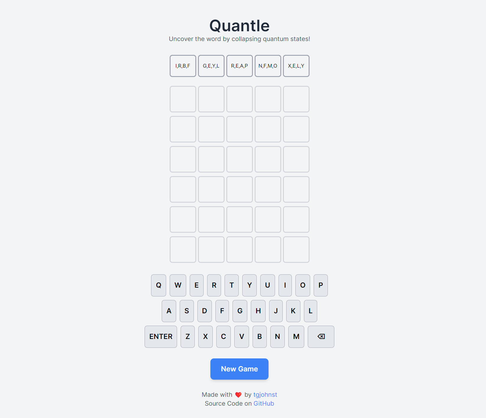

# **Quantle \- A Quantum Word Game**

Hosted at: [https://tgjohnst.github.io/quantle/](https://tgjohnst.github.io/quantle/)

## **What is Quantle?**

Quantle is a twist on popular word-guessing games, introducing a "quantum" mechanic. Instead of each letter slot having a single hidden letter, each slot in the 5-letter target word starts in a "superposition" of several potential letters (currently 4 possibilities per slot). Your guesses help "collapse" these possibilities, not just for the slot you guessed, but globally, as information about letters (whether they are in the word, not in the word, or in a specific position) affects all potential states.  
The goal is to deduce the secret 5-letter word within 6 guesses.

## **How to Play**

1. **The Game Board:**  
   * **Potential State Display:** At the top of the screen, you'll see five "potential tiles." Each tile initially shows 4 possible uppercase letters. One of these letters is the true letter for that position in the hidden word. As you guess, these possibilities will narrow down.  
   * **Guess Grid:** A standard 6x5 grid where your guesses will appear.  
   * **On-Screen Keyboard:** Use this to type your guesses. Keys will change color based on feedback.  
2. **Making a Guess:**  
   * Enter any valid 5-letter word.  
   * Press "ENTER" to submit your guess.  
3. **Understanding the Feedback (The Quantum Effect\!):**  
   * **GREEN Tile:** The letter is in the word AND in the correct position.  
     * *Quantum Implication:* The corresponding "Potential State" tile for this position will collapse to show only this correct green letter. The letter on your keyboard also turns green.  
   * **YELLOW Tile:** The letter is in the word BUT in the wrong position.  
     * *Quantum Implication:* This letter *cannot* be the correct letter for the *current guessed position* in the Potential State display. If it was listed as a possibility in that specific potential slot, it will be removed. The letter on your keyboard turns yellow (unless it's already green from another position).  
   * **GREY Tile:** The letter is NOT in the word at all.  
     * *Quantum Implication (Most Powerful\!):* This grey letter is removed as a possibility from *ALL* five "Potential State" tiles across the board. This can cause a cascade of deductions, as other potential slots might simplify or even fully collapse if all other options are eliminated. The letter on your keyboard turns grey.  
4. **Implicit Collapse:**  
   * If, through elimination (mostly by grey letters), a "Potential State" tile is reduced to a single possible letter, it has effectively "collapsed" to that letter.  
   * If this implicitly collapsed letter is the correct one for that slot, the potential tile will get a subtle highlight.  
5. **Winning the Game:**  
   * You win if you guess the word correctly (all letters in a guess row turn green).  
   * You can also win through a "Quantum Collapse": if all slots in the "Potential State" display collapse to show the correct letters of the target word, even if you haven't guessed the full word directly in a row.  
6. **Losing the Game:**  
   * You lose if you do not guess the word or achieve a full Quantum Collapse within 6 tries. The correct word will then be revealed.  
7. **New Game:**  
   * Click the "New Game" button to start over with a new target word and fresh quantum states.

## **Features**

* Dynamic "Potential State" display showing narrowing possibilities.  
* Color-coded feedback on guess tiles and keyboard.  
* Animations for tile flips and letter pops.  
* Responsive design for play on different screen sizes.

## Screenshot

## **How to Run**

Quantle is a single HTML file, with two json files for word dictionaries. Simply open the `index.html` file in a modern web browser (like Chrome, Firefox, Safari, or Edge) to play. No internet connection is required after the initial page load (as it uses standard browser features and Tailwind CSS from a CDN).  
Have fun collapsing those quantum states and finding the words\!
